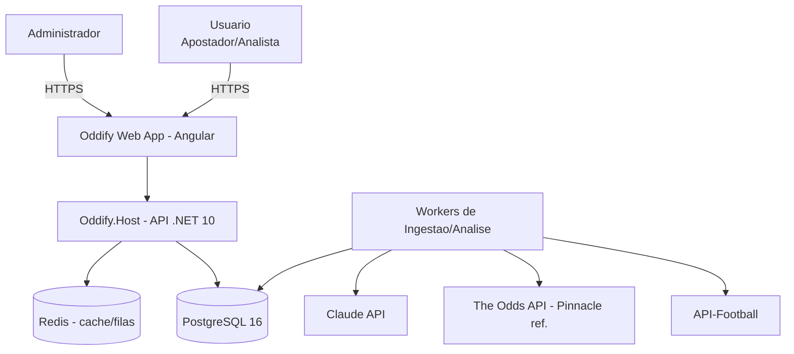
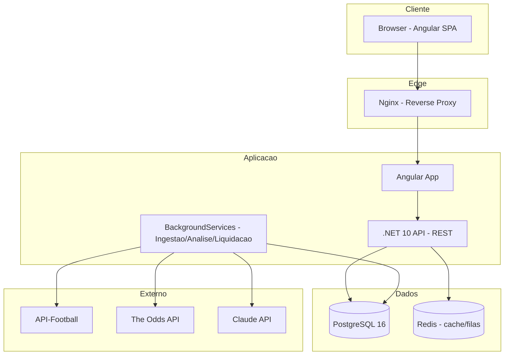
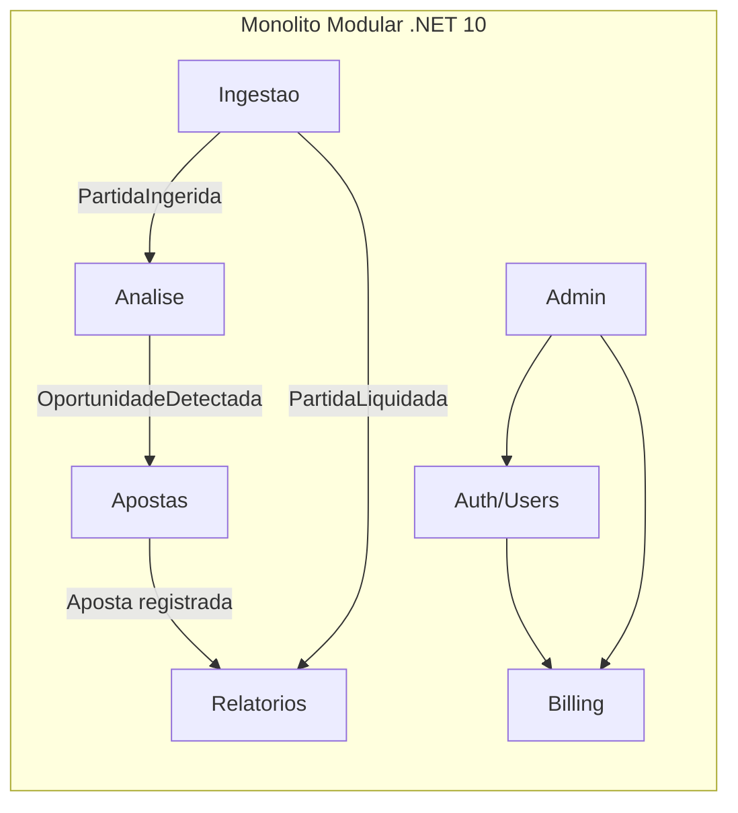

# ⚽ Oddify Analytics Platform
## Especificação Oficial de Produto, Arquitetura e Implementação

| Campo | Valor |
|---|---|
| **Nome do Sistema** | Oddify Analytics Platform |
| **Versão do Documento** | 1.0.0 |
| **Data de Emissão** | 02/08/2026 |
| **Autor** | Rafael — Produto & Engenharia |
| **Classificação** | Especificação Técnica — Fonte Única de Verdade |
| **Status** | Aprovado para início de implementação (Fase 0) |
| **Stack** | .NET 10 (LTS) · Angular · PostgreSQL 16 |

### Objetivo Executivo

O **Oddify** é uma plataforma SaaS de análise de apostas esportivas que combina um **motor estatístico próprio** (Poisson + Dixon-Coles) com uma **camada de inteligência artificial adversarial** (Claude via API) para detectar, filtrar e validar oportunidades de aposta de valor. O diferencial central não é mostrar dados — é **entregar oportunidades já peneiradas por matemática e criticadas por IA**, algo que nenhum concorrente de dados esportivos (Sofascore, Flashscore) ou tipster oferece.

A plataforma integra, inicialmente, duas fontes externas de dados: a **API-Football** (estatísticas de equipes e jogadores, escalações, eventos ao vivo, árbitro) e a **The Odds API** (odds de mercado, linha de referência da Pinnacle para validação de CLV e odds históricas para backtest), persistindo todo o histórico em **PostgreSQL** para permitir backtesting, medição de calibração e evolução dos modelos sem dependência contínua de terceiros.

Este documento é a fonte única de verdade para todas as decisões de produto, arquitetura, modelagem, integrações, segurança, operação e roadmap.

### Princípio Fundador (o que nos torna diferentes)

> **Determinístico calcula, probabilístico critica, os dados julgam.**
> O número (probabilidade, vantagem, stake) nasce sempre de código puro e testável. O Claude nunca gera o número — ele entra por último no funil como *advogado do diabo*, cortando falsos positivos que a estatística não enxerga. Nada permanece no sistema sem provar seu valor via Brier score e ROI. Esta é a espinha dorsal do produto e não é negociável em nenhuma fase.

---

## Sumário

1. Visão Geral do Produto
2. Requisitos Funcionais
3. Requisitos Não Funcionais
4. Arquitetura Completa
5. Modelagem de Dados
6. Estratégia de Ingestão
7. Integração com API-Football
8. Integração com The Odds API
9. O Motor de Análise (núcleo do produto)
   - 9.1 Catálogo de Estratégias e Mercados (E-01, E-02...)
10. Backend (.NET 10)
11. Frontend (Angular)
12. Segurança e Multitenancy
13. Observabilidade
14. Testes
15. CI/CD e Deploy
16. Analytics e Modelos Estatísticos
17. Carteira e Gestão de Banca (pilar central do produto)
18. Monetização e Planos
19. Roadmap por Fases
20. Estimativa de Esforço (solo)
21. Custos Estimados
22. Riscos e Mitigação
23. Convenções de Código
24. Próximos Passos

---

## 1. Visão Geral do Produto

### 1.1 Problema Resolvido

O apostador que quer operar com método — não com intuição — enfrenta três problemas: (1) os dados estão fragmentados entre estatísticas e odds; (2) transformar dados em uma decisão de aposta exige modelagem estatística que a maioria não sabe fazer; (3) mesmo quem modela cai em falsos positivos — o modelo aponta valor onde há apenas informação que ele não capturou (desfalque, jogo sem importância, contexto de calendário).

O Oddify resolve os três: unifica os dados, aplica um motor estatístico pronto (o usuário não programa nada), e submete cada oportunidade a uma camada de IA que critica o resultado antes de apresentá-lo. O que o cliente recebe não é um dashboard de números — é uma **lista curada de oportunidades de valor**, cada uma com probabilidade do modelo, vantagem sobre a odd, e o parecer do Claude (CONFIRMA / REDUZ / VETA).

### 1.2 Público-Alvo

| Segmento | Descrição | Necessidade Principal |
|---|---|---|
| Apostador metódico | Aposta com base em valor esperado, não em palpite | Oportunidades filtradas e confiáveis, gestão de banca |
| Apostador iniciante sério | Quer aprender a apostar com método | Recomendações explicadas, educação embutida |
| Tipster / criador de conteúdo | Publica análises e prognósticos | Dados e oportunidades prontas para embasar conteúdo |
| Analista quantitativo | Roda modelos próprios | Exportação de séries históricas, CLV, dados brutos |

### 1.3 Diferenciais Competitivos

1. **Oportunidades filtradas, não dados crus** — o produto entrega decisões, não planilhas.
2. **Motor estatístico nativo** (Poisson + Dixon-Coles) exposto como feature, não como enfeite.
3. **Camada de IA adversarial** — o Claude como veto/ranking é único no mercado; concorrentes não têm nada equivalente.
4. **Medição honesta** — cada previsão é registrada e auditada por Brier score e CLV; o produto prova que funciona (ou ajusta o que não funciona).
5. **Foco inicial no futebol brasileiro** — Brasileirão Série A como base, expansão gradual, com calibração dedicada por liga.
6. **Gestão de banca embutida** — Kelly fracionado e montagem de múltiplas com disciplina, não só sinais soltos.

### 1.4 O que o cliente compra

O Oddify vende **os dois lados de valor de forma integrada**: as sugestões de aposta prontas (as oportunidades filtradas e validadas pelo Claude) **e** a ferramenta para o próprio usuário explorar dados, confrontos e histórico. O plano gratuito dá um gostinho (oportunidades limitadas, com atraso); os planos pagos liberam o fluxo completo em tempo hábil, gestão de banca, exportação e histórico.

### 1.5 Casos de Uso Principais

- **UC-01** — Como apostador, quero ver as oportunidades de valor da rodada, já filtradas por vantagem mínima e validadas pela IA, com a justificativa de cada uma.
- **UC-02** — Como apostador, quero que o sistema monte sugestões de múltiplas (2-3 pernas) com odd combinada em torno de 4.0, usando apenas pernas aprovadas.
- **UC-03** — Como apostador, quero registrar minha banca e receber o stake sugerido por Kelly fracionado para cada aposta.
- **UC-04** — Como analista, quero consultar o histórico de confrontos (H2H) e a forma recente de dois times.
- **UC-05** — Como usuário, quero acompanhar o desempenho do sistema (ROI, acurácia) de forma transparente antes de confiar nas sugestões.
- **UC-06** — Como analista quantitativo, quero exportar séries históricas de odds e análises em CSV/XLSX.
- **UC-07** — Como administrador, quero gerenciar usuários, planos e assinaturas.

---

## 2. Requisitos Funcionais

Notação de prioridade MoSCoW: **M**ust, **S**hould, **C**ould, **W**on't-now.
A coluna "Fase" indica quando o requisito entra no roadmap (ver seção 18).

### 2.1 Núcleo de Análise (o coração do produto)

**RF-01 — Detecção de Oportunidades (Must, Fase 1)**
O sistema calcula, para cada partida das ligas ativas, as probabilidades via Poisson + Dixon-Coles, compara com a odd de mercado (margem descontada) e aplica o `FiltroDeOportunidades`. Oportunidades aprovadas são apresentadas ao usuário.
- Critério de aceite: dado um conjunto de partidas com odds, o sistema lista apenas as que satisfazem vantagem ≥ 4 p.p., odd 1.40–1.70 e amostra ≥ 8 jogos, em liga calibrada.

**RF-02 — Validação por IA (Must, Fase 2)**
Cada oportunidade aprovada no filtro é submetida ao Claude como advogado do diabo, retornando CONFIRMA / REDUZ / VETA com justificativa. Vetadas não viram sugestão de aposta.
- Critério de aceite: toda oportunidade exibida tem parecer da IA registrado e visível; vetadas são ocultadas das sugestões mas auditáveis.

**RF-03 — Montagem de Múltiplas (Must, Fase 2)**
O sistema sugere múltiplas de 2-3 pernas, de partidas distintas, com odd combinada alvo ~4.0, usando apenas pernas confirmadas.
- Critério de aceite: nenhuma múltipla contém duas pernas do mesmo jogo; cada perna tem vantagem própria positiva.

**RF-04 — Gestão de Banca / Carteira (Must, Fase 2)**
O usuário mantém uma ou mais bancas, registra apostas (manuais ou vindas de sugestões) e acompanha saldo, lucro, ROI e assertividade. O sistema calcula o stake sugerido por Kelly fracionado (fração 0.25) com base na unidade da banca, retornando zero quando Kelly ≤ 0.
- Critério de aceite: o stake sugerido nunca excede o Kelly fracionado; Kelly negativo resulta em "não apostar"; o saldo é recalculado corretamente a cada liquidação.

**RF-04a — Múltiplas Bancas (Must, Fase 2)** — O usuário cria/gerencia várias bancas, cada uma com saldo inicial, perfil de risco (conservador/moderado/agressivo) e unidade (% por entrada). Critério: bancas isoladas; unidade recalculada quando o saldo muda.

**RF-04b — Registro de Apostas (Must, Fase 2)** — Registrar apostas simples, múltiplas e "criar aposta" (bet builder), de origem manual ou sugerida, com status em aberto/green/red/anulada e ações desfazer/excluir. Critério: uma múltipla registra N seleções; anulada devolve o stake sem afetar assertividade.

**RF-04c — Dashboard e Evolução da Banca (Must, Fase 2)** — Cards de saldo/lucro/ROI/assertividade/unidade, gráfico de evolução do saldo, distribuição green/red/anuladas e calendário de resultado diário, com filtro por período. Critério: o gráfico reflete todas as movimentações; o calendário marca lucro/prejuízo/sem apostas por dia.

**RF-04d — Relatório por Mercado e Perfil (Should, Fase 2/3)** — Desempenho por mercado/campeonato/time, perfil do apostador (entrada média, disciplina de stake, sequência) e recomendações automáticas a partir dos próprios dados. Critério: melhor e pior mercado destacados; recomendações baseadas em dados reais do usuário.

**RF-04e — Importar Print de Bilhete (Should, Fase 3)** — Upload do print; o Claude extrai os dados; o usuário confirma antes de persistir. Critério: extração implausível cai em confirmação pendente; print e JSON bruto guardados para auditoria.

**RF-04f — Depósitos e Saques (Should, Fase 2)** — Registrar aporte/retirada de capital, distinguindo-os do lucro de apostas. Critério: depósito/saque altera o saldo mas não o lucro/ROI de apostas.

**RF-05 — Paper Trading e Medição (Must, Fase 1)**
Todas as sugestões são registradas com sua previsão, odd e resultado real após liquidação. O sistema calcula ROI, hit rate e Brier score por camada (Poisson, Dixon-Coles, pós-Claude).
- Critério de aceite: relatório de calibração disponível, comparando as três camadas e a evolução por versão de prompt.

### 2.2 Dados e Consulta

**RF-06 — Agenda de Jogos (Must, Fase 1)** — Listagem filtrável por liga, time, data e status, com odds 1X2 resumidas inline.

**RF-07 — Página do Time (Must, Fase 1)** — Forma recente (últimos 5/10), gols marcados/sofridos, desempenho casa/fora, disciplina, escanteios médios.

**RF-08 — Página do Jogador (Should, Fase 3)** — Gols, assistências, cartões, minutos, notas por temporada.

**RF-09 — Confrontos Diretos / H2H (Must, Fase 1)** — Histórico entre dois times, com tendências ("mais de 2.5 gols em 7 dos últimos 10").

**RF-10 — Forma Recente (Must, Fase 1)** — Sequência visual V/E/D dos últimos N jogos, filtrável por competição.

**RF-11 — Histórico de Jogos Encerrados (Must, Fase 1)** — Resultado, estatísticas completas, odds de fechamento para CLV.

### 2.3 Odds

**RF-12 — Odds Pré-Jogo (Must, Fase 1)** — Odds 1X2, over/under, ambas marcam, por casa, atualizadas periodicamente.

**RF-13 — Histórico de Odds / Movimento de Linha (Should, Fase 3)** — Série temporal da abertura ao fechamento, com gráfico.

**RF-14 — Comparador de Casas (Could, Fase 3)** — Tabela comparativa entre bookmakers, destacando a melhor odd.

**RF-15 — CLV / Closing Line Value (Must, Fase 2)** — Comparação da odd pega contra a de fechamento da Pinnacle, como métrica de qualidade das sugestões.

### 2.4 Produtividade

**RF-16 — Favoritos e Watchlist (Should, Fase 3)** — Marcar ligas/times e monitorar jogos específicos.

**RF-17 — Exportação CSV/XLSX (Should, Fase 3)** — Exportar tabelas de fixtures, odds, análises.

**RF-18 — Notificações de Oportunidade (Should, Fase 4)** — Alerta (e-mail/push) quando surgir oportunidade de valor nas ligas favoritas.

### 2.5 SaaS (a "embalagem" comercial)

**RF-19 — Autenticação e Cadastro (Must, Fase 2)** — Registro, login, reset de senha, verificação de e-mail.

**RF-20 — Multitenancy / Isolamento por Usuário (Must, Fase 2)** — Cada usuário tem sua banca, favoritos, watchlist e histórico isolados.

**RF-21 — Planos e Assinaturas (Must, Fase 5)** — Free, Pro e Premium; integração com gateway de pagamento; upgrade/downgrade/cancelamento.

**RF-22 — Painel Administrativo (Must, Fase 5)** — Gestão de usuários, planos, permissões, métricas de uso.

**RF-23 — Logs e Auditoria (Should, Fase 5)** — Registro de ações sensíveis (login, mudança de plano, exportação).

**RF-24 — API Pública (Could, Fase 6)** — Endpoints REST documentados via OpenAPI, autenticados por API Key, rate limit por plano.

### 2.6 Tabela-Resumo

| ID | Funcionalidade | Prioridade | Fase | Módulo |
|---|---|---|---|---|
| RF-01 | Detecção de Oportunidades | Must | 1 | Analise |
| RF-02 | Validação por IA | Must | 2 | Analise |
| RF-03 | Montagem de Múltiplas | Must | 2 | Apostas |
| RF-04 | Gestão de Banca / Carteira | Must | 2 | Apostas |
| RF-04a | Múltiplas Bancas | Must | 2 | Apostas |
| RF-04b | Registro de Apostas | Must | 2 | Apostas |
| RF-04c | Dashboard e Evolução | Must | 2 | Apostas |
| RF-04d | Relatório por Mercado/Perfil | Should | 2 | Apostas |
| RF-04e | Importar Print | Should | 3 | Apostas |
| RF-04f | Depósitos e Saques | Should | 2 | Apostas |
| RF-05 | Paper Trading e Medição | Must | 1 | Relatorios |
| RF-06 | Agenda de Jogos | Must | 1 | Ingestao |
| RF-07 | Página do Time | Must | 1 | Analytics |
| RF-08 | Página do Jogador | Should | 3 | Analytics |
| RF-09 | Confrontos Diretos | Must | 1 | Analytics |
| RF-10 | Forma Recente | Must | 1 | Analytics |
| RF-11 | Jogos Encerrados | Must | 1 | Ingestao |
| RF-12 | Odds Pré-Jogo | Must | 1 | Odds |
| RF-13 | Histórico de Odds | Should | 3 | Odds |
| RF-14 | Comparador de Casas | Could | 3 | Odds |
| RF-15 | CLV | Must | 2 | Relatorios |
| RF-16 | Favoritos/Watchlist | Should | 3 | Users |
| RF-17 | Exportação | Should | 3 | Analytics |
| RF-18 | Notificações | Should | 4 | Alerts |
| RF-19 | Autenticação | Must | 2 | Auth |
| RF-20 | Multitenancy | Must | 2 | Auth |
| RF-21 | Planos/Assinaturas | Must | 5 | Billing |
| RF-22 | Painel Admin | Must | 5 | Admin |
| RF-23 | Logs/Auditoria | Should | 5 | Admin |
| RF-24 | API Pública | Could | 6 | Public API |

---

## 3. Requisitos Não Funcionais

| ID | Categoria | Requisito | Meta/Métrica |
|---|---|---|---|
| RNF-01 | Performance | Tempo de resposta da API | p95 < 300ms nas consultas de leitura |
| RNF-02 | Performance | Carregamento de página (LCP) | < 2.5s |
| RNF-03 | Escalabilidade | Usuários concorrentes | Centenas no lançamento, arquitetura que escala a milhares |
| RNF-04 | Disponibilidade | Uptime | 99% (adequado a SaaS em estágio inicial; não prometer 99.9% sem estrutura) |
| RNF-05 | Segurança | Autenticação | Hash de senha com Argon2id ou bcrypt; JWT com refresh |
| RNF-06 | Privacidade | LGPD | Consentimento, exclusão de conta, exportação de dados pessoais |
| RNF-07 | Observabilidade | Rastreabilidade | CorrelationId em 100% das requisições e jobs |
| RNF-08 | Manutenibilidade | Cobertura de testes | ≥ 80% nos módulos críticos (motor de análise, apostas, auth) |
| RNF-09 | Portabilidade | Infraestrutura | 100% containerizada (Docker) |
| RNF-10 | Auditabilidade | Ações sensíveis | Registradas com ator, timestamp e contexto |
| RNF-11 | Custo | Orçamento de APIs externas | Respeitar tiers gratuitos/baratos na fase inicial (100 req/dia API-Football) |
| RNF-12 | Idempotência | Ingestão | Reprocessar a mesma partida não duplica dados (upsert por external_id) |

### 3.1 Metas de Capacidade (Sizing Inicial)

- Ingestão: começar com Brasileirão Série A (~380 jogos/temporada), expandir para 2-3 ligas conforme calibração. Volume de odds moderado (poucas coletas por jogo, focadas nas próximas 48h).
- Retenção: histórico indefinido — o dado acumulado é o ativo do produto e a base do backtesting.
- Orçamento de requisições: a cota diária da API-Football (100 req/dia no tier gratuito) é uma **restrição de primeira classe** que molda os jobs de ingestão.

---

## 4. Arquitetura Completa

### 4.1 Estilo Arquitetural

**Monolito Modular** em .NET 10, com Clean Architecture dentro de cada módulo. Um único processo de aplicação (`Oddify.Host`) que expõe a API REST consumida pelo frontend Angular e hospeda os workers de ingestão/análise em background. Comunicação entre módulos exclusivamente por **eventos de domínio** ou **contratos de leitura** próprios do consumidor — nunca por referência direta entre entidades de módulos diferentes.

Por que monolito modular e não microserviços: projeto em estágio inicial, operado por equipe muito enxuta. Microserviços aqui seriam custo de operação sem benefício. As fronteiras modulares dão o isolamento lógico; se um módulo precisar escalar sozinho no futuro, a fronteira já existe e a extração é mecânica.

### 4.2 Diagrama de Contexto (C4 — Nível 1)



### 4.3 Diagrama de Containers (C4 — Nível 2)



### 4.4 Módulos do Backend (C4 — Nível 3)



Responsabilidades:
- **Auth/Users** — cadastro, login, JWT, RBAC, dados de conta e preferências (favoritos, watchlist). Base do multitenancy.
- **Ingestao** — sincroniza ligas, times, jogadores, partidas, estatísticas e odds da API-Football e da The Odds API; liquidação pós-jogo. Publica `PartidaIngerida` e `PartidaLiquidada`.
- **Analise** — o motor: cálculo de lambdas por liga, Poisson, Dixon-Coles, comparação com odd, `FiltroDeOportunidades`, e o Claude como advogado do diabo. Publica `OportunidadeDetectada`.
- **Apostas / Carteira** — pilar central: múltiplas bancas por usuário, registro de apostas (manuais e sugeridas), liquidação e saldo, métricas (ROI, assertividade, disciplina), Kelly fracionado, montagem de múltiplas, importação de print e relatório por mercado. Detalhado na seção 17.
- **Relatorios** — Brier score por camada, ROI, CLV, auditoria de filtro e vetos.
- **Billing** — planos, assinaturas, gateway de pagamento, controle de limites por plano.
- **Admin** — gestão de usuários, planos, métricas, logs de auditoria.

### 4.5 Camadas dentro de cada módulo (Clean Architecture)

```
Modulo/
├── Domain/           entidades, value objects, eventos de dominio, regras invariantes
├── Application/       casos de uso (MediatR), handlers, contratos (interfaces)
├── Infrastructure/    implementacoes: clientes HTTP, repositorios, ClaudeAnalyst
└── PublicContracts/   eventos de integracao e DTOs publicos (unica parte 'public')
```

Regra imposta pelo compilador: quase tudo `internal`; só `PublicContracts` é `public`. Domain não referencia Infrastructure. A dependência aponta sempre para dentro.

---

## 5. Modelagem de Dados

Banco: **PostgreSQL 16**. ORM: **EF Core 10**. Convenções: nomes de tabela e coluna em `snake_case`; chaves primárias `BIGINT GENERATED ALWAYS AS IDENTITY`; `external_id` com constraint UNIQUE para idempotência da ingestão; `created_at`/`updated_at` em `TIMESTAMPTZ`; `raw_payload JSONB` guardando a resposta bruta da API para auditoria e reprocessamento (recurso nativo do EF Core 10 para o tipo JSON do Postgres).

Um **schema por módulo** (`ingestao`, `analise`, `apostas`, `relatorios`, `auth`, `billing`). **Sem foreign key física entre schemas de módulos diferentes** — referências cruzadas são por id, com consistência garantida pela aplicação via eventos. Isso preserva a fronteira modular no banco.

### 5.1 Convenção Multitenancy

Toda entidade que pertence a um usuário carrega `usuario_id BIGINT NOT NULL` (FK para `auth.usuarios`), com índice. Entidades de dados compartilhados (ligas, times, partidas, estatísticas, odds) **não** têm `usuario_id` — são globais, ingeridas uma vez e lidas por todos. Entidades pessoais (banca, apostas, favoritos, watchlist, preferências) são isoladas por `usuario_id`. Essa separação é a decisão-chave que torna o sistema multiusuário sem duplicar dados de mercado.

### 5.2 Dados Globais (schema ingestao) — compartilhados entre usuarios

**ligas** — id · external_id (UK) · nome · tipo (liga/copa) · pais · logo_url · media_de_gols · fator_casa · calibrada (bool) · ativa · created_at · updated_at

**temporadas** — id · liga_id (FK) · ano · data_inicio · data_fim · atual (bool) · UK(liga_id, ano)

**equipes** — id · external_id (UK) · nome · nome_curto · pais · logo_url · estadio_id (FK) · created_at · updated_at

**estadios** — id · external_id (UK) · nome · cidade · capacidade

**jogadores** — id · external_id (UK) · equipe_id (FK) · nome · posicao · nacionalidade · created_at · updated_at

**partidas** — id · external_id (UK) · liga_id (FK) · temporada_id (FK) · equipe_casa_id (FK) · equipe_visitante_id (FK) · estadio_id (FK) · rodada · situacao (agendada/ao_vivo/encerrada/liquidada/adiada/cancelada) · data_utc · minuto · gols_casa · gols_visitante · gols_casa_ht · gols_visitante_ht · xg_casa · xg_visitante · raw_payload (JSONB) · created_at · updated_at
  - Índices: (liga_id, temporada_id), equipe_casa_id, equipe_visitante_id, situacao (parcial p/ ao_vivo e agendada), data_utc

**eventos_da_partida** — id · partida_id (FK) · equipe_id (FK) · jogador_id (FK) · jogador_assist_id (FK) · tipo (gol/gol_contra/penalti/cartao_amarelo/cartao_vermelho/substituicao/var) · detalhe · minuto · minuto_extra · created_at

**estatisticas_da_equipe** — id · partida_id (FK) · equipe_id (FK) · gols · finalizacoes · finalizacoes_no_alvo · posse_pct · escanteios · impedimentos · faltas · cartoes_amarelos · cartoes_vermelhos · passes · passes_certos · xg · UK(partida_id, equipe_id)

**estatisticas_do_jogador** — id · partida_id (FK) · jogador_id (FK) · equipe_id (FK) · minutos · titular (bool) · gols · assistencias · cartoes_amarelos · cartoes_vermelhos · nota · UK(partida_id, jogador_id)

**cotacoes** — id · partida_id (FK) · mercado · casa · odd · eh_fechamento (bool) · coletada_em (TIMESTAMPTZ) · raw_payload (JSONB)
  - Índices: (partida_id, mercado), coletada_em

### 5.3 Dados de Análise (schema analise) — global

**analises_da_partida** — id · partida_id · mercado · prob_poisson_pura · prob_dixon_coles · prob_implicita_da_odd · vantagem · odd_de_mercado · aprovada_no_filtro (bool) · motivo_do_descarte · decisao_do_claude (confirma/reduz/veta/nao_avaliada) · justificativa_do_claude · resposta_llm_bruta · versao_do_prompt · created_at
  - `partida_id` é referência lógica (sem FK física — módulo diferente)
  - Índices: partida_id, aprovada_no_filtro, decisao_do_claude

### 5.4 Dados de Usuario (schema auth) — isolado por usuario

**usuarios** — id · email (UK) · hash_senha · nome · email_verificado (bool) · papel (usuario/admin) · plano_id (FK billing) · created_at · updated_at

**preferencias** — id · usuario_id (FK) · ligas_favoritas (JSONB) · times_favoritos (JSONB) · limiar_de_alerta

**watchlist** — id · usuario_id (FK) · partida_id · created_at · UK(usuario_id, partida_id)

### 5.5 Dados de Apostas / Carteira (schema apostas) — isolado por usuario

**bancas** — id · usuario_id (FK) · nome ("Banca principal") · saldo_inicial · saldo_atual · perfil_de_risco (conservador/moderado/agressivo) · percentual_por_entrada (a "unidade", ex.: 3%) · modo (paper/real) · ativa (bool) · created_at · updated_at
  - Um usuário pode ter **várias bancas** (ex.: uma real, uma de teste). Índice: usuario_id.
  - `valor_da_unidade` = saldo_atual × percentual_por_entrada (derivado, não persistido).

**apostas** — id · usuario_id (FK) · banca_id (FK) · origem (manual/sugerida) · analise_id (ref. lógica, nulo se manual) · descricao · tipo (simples/multipla/criar_aposta) · odd · stake · retorno_potencial · resultado (em_aberto/green/red/anulada/meio_green/meio_red) · lucro_ou_perda · data_do_jogo · data_registro · created_at · updated_at
  - `origem` distingue aposta registrada pelo usuário (manual/importada) de aposta vinda de uma sugestão do sistema — ambas convivem na mesma carteira.
  - Índices: (usuario_id, banca_id), resultado, data_do_jogo.

**selecoes_da_aposta** — id · aposta_id (FK) · descricao (ex.: "Mais de 1.5 - Flamengo x SP") · mercado · evento · odd · resultado (em_aberto/green/red/anulada)
  - Uma aposta simples tem 1 seleção; múltipla/criar aposta têm N. Permite representar as múltiplas das telas.

**movimentacoes_da_banca** — id · banca_id (FK) · tipo (deposito/saque/ajuste/liquidacao_aposta) · valor · saldo_resultante · aposta_id (ref., nulo se ajuste manual) · descricao · created_at
  - Histórico imutável de tudo que mexeu no saldo — base do gráfico de evolução e da auditoria. Cada liquidação de aposta gera uma movimentação; depósitos/saques manuais também.

**importacoes_de_print** — id · usuario_id (FK) · banca_id (FK) · caminho_do_print · json_extraido_bruto · status (processando/confirmacao_pendente/confirmada/falhou) · aposta_id (ref., preenchido após confirmação) · created_at
  - Suporta o "Importar print": o Claude (visão) extrai os dados do print do bilhete, o usuário confirma, e vira uma `aposta` de origem manual.

### 5.6 Dados de Billing (schema billing)

**planos** — id · nome (free/pro/premium) · preco_mensal · limite_oportunidades_dia · exportacao_habilitada (bool) · atraso_minutos (delay das oportunidades no free)

**assinaturas** — id · usuario_id (FK) · plano_id (FK) · status (ativa/cancelada/inadimplente) · gateway_ref · inicio · fim · created_at

### 5.7 Infraestrutura de Consistência (schema compartilhado)

**outbox_mensagens** — id · tipo_do_evento · conteudo (JSONB) · processada_em (TIMESTAMPTZ nulo enquanto pendente) · tentativas · created_at
  - Garante entrega de eventos entre módulos mesmo em falha de processo (evolução da Fase 3+; na Fase 1-2, eventos in-process do MediatR + job de varredura como rede de segurança).

### 5.8 Auditoria (schema compartilhado)

**logs_de_auditoria** — id · usuario_id · acao · entidade · contexto (JSONB) · correlation_id · created_at


---

## 6. Estratégia de Ingestão

Workers em `BackgroundService` orquestram três fluxos, todos respeitando o `OrcamentoDeRequisicoes` (cota diária da API-Football):

1. **Job de Ingestão (diário)** — sincroniza partidas futuras, elencos e odds das ligas calibradas. Prioriza jogos das próximas 48h.
2. **Job de Análise** — para cada partida das próximas 48h sem análise, dispara o pipeline do motor.
3. **Job de Liquidação (pós-jogo)** — coleta resultado final e estatísticas, resolve apostas, alimenta os relatórios. Também funciona como rede de segurança para eventos de domínio eventualmente perdidos.

Princípios: **cache agressivo** de dados históricos (mudam pouco); **upsert idempotente** por `external_id` (reprocessar não duplica); **nunca varrer tudo** — coletar odds só para partidas com análise agendada; **sem scraping** — apenas APIs oficiais (scraping é fundação que desmorona sem aviso).

---

## 7. Integração com API-Football

Fonte primária de dados esportivos: estatísticas de equipes e jogadores, 1.200+ ligas, odds pré-jogo. Tier gratuito: 100 requisições/dia — restrição de primeira classe.

Abstração: `IProvedorDeEstatisticas` na camada Application do módulo Ingestao; implementação `ApiFootballClient` na Infrastructure, com HttpClient tipado + Polly (retry, circuit breaker, rate limiter respeitando a cota). Toda resposta é persistida em `raw_payload` antes do parse, permitindo reprocessamento sem nova chamada.

**Autenticação.** A chave é enviada por header. Há dois caminhos de acesso ao mesmo serviço — escolher **um**:
- acesso direto (apisports.io): header `x-apisports-key`;
- acesso via RapidAPI: headers `x-rapidapi-key` e `x-rapidapi-host`.

A chave **nunca** aparece no código nem neste documento: é lida da configuração (`ApiFootball:ApiKey`), que vem de User Secrets em desenvolvimento e de variáveis de ambiente em produção (ver seção 12). Exemplo de estrutura no `appsettings.json`, apenas com placeholder:
```json
{
  "ApiFootball": {
    "BaseUrl": "https://v3.football.api-sports.io",
    "ApiKey": ""   // vazio no repo; preenchido via User Secrets / variavel de ambiente
  }
}
```

---

## 8. Integração com The Odds API

Fonte de odds inicial: **The Odds API**, escolhida por dar acesso à linha da **Pinnacle** (referência de mercado) e a **odds históricas** — as duas coisas de que o Oddify precisa: a Pinnacle para o cálculo de CLV e o histórico para backtest das estratégias. Tier gratuito: 500 requisições/mês. Abstração `IProvedorDeOdds`, análoga à de estatísticas, com HttpClient tipado + Polly. A odd de fechamento da Pinnacle é o benchmark: bater a linha de fechamento consistentemente (CLV positivo) é o teste mais respeitado de que o modelo tem edge — antes mesmo do lucro.

Ponto de atenção já registrado (ver 9.1.9): a cobertura de **totais de 1º tempo** na The Odds API é limitada para mercados não-destacados — a validar antes de fechar o plano da estratégia ao vivo (E-02). Provedores alternativos (ex.: OddsPapi) ficam como plano B caso a cobertura ou a cota se mostrem insuficientes; a abstração `IProvedorDeOdds` torna a troca barata.

**Autenticação.** A The Odds API recebe a chave como **query parameter** `apiKey` na URL da requisição (ex.: `.../v4/sports/soccer_brazil_campeonato/odds?apiKey=...&regions=eu&markets=h2h,totals`). Cada resposta traz nos headers `x-requests-remaining` e `x-requests-used`, que o cliente deve ler para alimentar o `OrcamentoDeRequisicoes` e pausar a coleta antes de estourar a cota. Como a chave viaja na URL, o cliente **não** deve logar a URL completa (o `CorrelationId` e o endpoint bastam no log). A chave é lida da configuração (`TheOddsApi:ApiKey`), nunca hardcoded:
```json
{
  "TheOddsApi": {
    "BaseUrl": "https://api.the-odds-api.com/v4",
    "ApiKey": ""   // vazio no repo; preenchido via User Secrets / variavel de ambiente
  }
}
```

---

## 9. O Motor de Análise (núcleo do produto)

Este é o diferencial competitivo e a peça de maior valor. Fluxo (funil):

```
Todas as ligas calibradas
  -> Calculo dos lambdas por liga (forca de ataque/defesa + fator casa)
  -> Poisson (matriz de placares)
  -> Correcao de Dixon-Coles (parametro rho nas celulas 0x0,1x0,0x1,1x1)
  -> Comparacao com a odd (vantagem = prob. modelo - prob. implicita, margem descontada)
  -> FiltroDeOportunidades (codigo puro, testavel):
        vantagem >= 4 p.p. E odd 1.40-1.70 E amostra >= 8 jogos E liga calibrada
        reprovadas: registradas para auditoria
  -> Claude como ADVOGADO DO DIABO (so nas aprovadas):
        recebe contexto de jogadores (desfalques, lesoes, calendario)
        responde CONFIRMA / REDUZ / VETA + justificativa + ranking
  -> Montagem de multiplas (pernas confirmadas, jogos distintos, alvo ~4.0)
  -> Kelly fracionado -> paper trading -> Brier/ROI/CLV por liga
```

Fundamentos: gols em futebol aproximam um processo de Poisson; Dixon-Coles corrige a subestimação de placares baixos. A faixa de odd 1.40-1.70 é restrição **secundária** (reduz variância, casa com múltiplas ~4.0), nunca o critério — quem decide é a vantagem matemática. O Claude protege contra falsos positivos (contexto que os números não capturam), nunca gera o número. Cada camada é auditada: se piora o Brier score, é desligada com evidência.

O papel do Claude é ajuste marginal e veto, limitado a ±10 p.p. quando ajusta, sempre com justificativa. Aposta só em mercado precificado pelo motor — o Claude pode sugerir novos mercados para modelar, nunca apostar em mercado sem probabilidade calculada.

---


### 9.1 Catálogo de Estratégias e Mercados

Esta seção funde duas visões que são inseparáveis na prática: **o mercado** (o que se aposta e como sua probabilidade é calculada) e **a estratégia** (quando aquilo vira uma oportunidade de valor). Uma estratégia é, na definição precisa do sistema, **uma calculadora de probabilidade para um mercado, acoplada ao filtro de edge comum.**

#### 9.1.0 O princípio comum a todas as estratégias

Toda estratégia responde à mesma pergunta única:

> A probabilidade calculada pelo modelo é maior que a probabilidade implícita na odd oferecida?

```
prob_implicita_bruta = 1 / odd          (ainda contém a margem da casa)
prob_implicita_justa  = RemovedorDeMargem(mercado)   (normalizada p/ somar 100%)

edge = prob_modelo × odd_justa − 1
     = prob_modelo − prob_implicita_justa   (formas equivalentes)

DISPARAR SE edge >= 0.03
```

**Atenção — a margem NÃO é opcional.** `1/odd` cru embute a margem da casa (a soma das implícitas de um mercado dá >100%). Comparar o modelo contra essa implícita suja infla o edge artificialmente e faz o filtro aprovar apostas sem valor real. Por isso o `RemovedorDeMargem` (ver 9.1.3) é etapa obrigatória antes de calcular qualquer edge.

**Não são N sistemas independentes — é um filtro de edge com N calculadoras de probabilidade.** Todas compartilham a mesma infraestrutura: `AvaliadorDeEdge` (aplica o limiar), `GestorDeStake` (Kelly fracionário ¼, teto de 5% da banca), `RegistroClv` (odd pega vs. fechamento Pinnacle) e a `CamadaCritica` (o Claude, que **só veta ou reduz, nunca cria** oportunidade que o modelo não encontrou).

**A base matemática compartilhada.** A maioria das estratégias parte de uma matriz de placares `M`, onde `M[i][j] = P(casa marca i) × P(visitante marca j)`. Cada mercado de gols é uma **soma de um subconjunto de células** dessa matriz; a correção de Dixon-Coles ajusta as células de placar baixo (0-0, 1-0, 0-1, 1-1) que o Poisson simples subestima. Adicionar um mercado de gols novo é uma nova regra de soma, não um modelo novo.

**Limiar de edge = 3%.** Abaixo disso, o erro de calibração do λ é maior que o próprio edge — o sinal seria ruído. (Nota: o motor descrito na seção 9 usa 4 p.p. como limiar padrão do `FiltroDeOportunidades`; 3% é o piso absoluto por estratégia. O limiar efetivo de cada estratégia é um parâmetro versionado — ver metadados abaixo — e nunca fica abaixo de 3%.)

#### 9.1.1 Metadados e registro obrigatórios por estratégia

Cada estratégia é uma **entidade nomeada e versionada**, não um trecho de código solto. Isso é inegociável: sem versionar, quando v1 e v2 compartilham histórico não há como saber qual mudança melhorou o resultado.

**Metadados:** `Codigo` · `Versao` · `NomeComercial` · `Mercados` · `Modo` (pré-jogo / ao vivo) · `LimiarDeEdge` · `FonteLambda` · `DataCalibracao`

**Registro de desempenho (por estratégia, separado):** entradas · CLV médio · ROI · drawdown máximo · taxa de acerto vs. break-even. É esse registro separado que permite **matar** as estratégias que não pagam — a razão de existirem como entidades nomeadas.

#### 9.1.2 Contrato técnico

```
IEstrategia
    Avaliar(ContextoPartida) -> ResultadoAvaliacao

Cada implementacao produz prob_modelo para seu(s) mercado(s);
o AvaliadorDeEdge comum aplica o limiar e decide DISPARAR / DESCARTAR.
```

#### 9.1.3 Serviços determinísticos do motor (código puro, testável)

Todas as estratégias se apoiam num conjunto pequeno de serviços sem dependências externas — o núcleo que deve ser implementado e coberto por testes na Fase 0, antes de qualquer banco ou API. A ordem abaixo é também a ordem de dependência (cada um consome os anteriores).

**`EstimadorDeParametros`** — produz os parâmetros de calibração que alimentam todo o resto, a partir do histórico de partidas de uma liga:
- índices de **ataque** e **defesa** por time, relativos à média da liga (1.0 = média), com **decaimento temporal** `φ = e^(−ξ · dias)` (ξ ≈ 0.0065, meia-vida ~107 dias) para dar mais peso a jogos recentes;
- **fator mando** da liga (vantagem média do mandante);
- **λ médio** da liga (recalibrado semanalmente);
- **ρ (rho)** do Dixon-Coles, estimado por máxima verossimilhança sobre o histórico da liga.
É o "cérebro de calibração". Sua saída é persistida por liga (ver `ligas.media_de_gols`, `fator_casa`, e parâmetros associados) e datada (`DataCalibracao`).

**`CalculadoraDeLambdas`** — dado um confronto, combina os índices do `EstimadorDeParametros` em dois λ:
```
λ_casa      = ataque_casa × defesa_visitante × fator_mando
λ_visitante = ataque_visitante × defesa_casa
```

**`CalculadoraDePoisson`** — a partir dos dois λ, gera a matriz de placares `M[i][j] = P(casa=i) × P(visitante=j)` (teto de gols parametrizável, padrão 8) e expõe as somas de células por mercado (1X2, over/under, BTTS, etc.). Também oferece a forma fechada `P(over N)` para quando só o total interessa.

**`CorrecaoDixonColes`** — recebe a matriz do Poisson e o ρ, e aplica o fator τ(i,j; ρ) às quatro células de placar baixo (0-0, 1-0, 0-1, 1-1), corrigindo a subestimação de empates e placares baixos do Poisson simples. Devolve a matriz corrigida, usada pelas estratégias de resultado/proteção (E-06) e de correlação (E-07).

**`RemovedorDeMargem`** — recebe as odds de **todas** as seleções de um mercado e devolve a probabilidade implícita **justa** (normalizada para somar 100%, retirando a margem da casa). Etapa obrigatória antes de qualquer cálculo de edge — sem ela, o edge fica sistematicamente inflado. Método padrão: normalização proporcional (dividir cada `1/odd` pela soma dos `1/odd` do mercado); métodos mais sofisticados (ex.: remoção proporcional ao favorito / Shin) ficam como evolução, com a interface estável.

**Serviços de decisão e registro (consomem os acima):**
- **`AvaliadorDeEdge`** — aplica `edge = prob_modelo − prob_implicita_justa` e o limiar (≥ 3% piso; 4 p.p. padrão do filtro geral).
- **`GestorDeStake`** — Kelly fracionário (¼), teto de 5% da banca, zero se Kelly ≤ 0.
- **`RegistroClv`** — registra odd pega vs. fechamento Pinnacle (o juiz de qualidade).
- **`CamadaCritica`** — o Claude, que só veta ou reduz, nunca cria oportunidade.

**Fluxo de dependência resumido:**
```
EstimadorDeParametros → CalculadoraDeLambdas → CalculadoraDePoisson → CorrecaoDixonColes
                                                                            ↓
odds de mercado → RemovedorDeMargem → prob_implicita_justa                  ↓
                                              ↓                             ↓
                                         AvaliadorDeEdge ← prob_modelo ─────┘
                                              ↓
                                    GestorDeStake / RegistroClv / CamadaCritica
```

---

#### E-01 · Total de Gols (Over/Under) — pré-jogo
*Nome comercial: "Vai Sair Gol"*

- **Mercado:** total de gols na partida (linhas 0.5, 1.5, 2.5, 3.5...).
- **Modo:** pré-jogo.
- **Status:** V1 — é a estratégia-âncora, só depende do λ de gols.

**Modelo:**
```
λ_casa      = ataque_casa × defesa_visitante × fator_mando
λ_visitante = ataque_visitante × defesa_casa
λ_jogo      = λ_casa + λ_visitante

P(over N) = 1 − Σ(k=0..N) [ e^(−λ_jogo) · λ_jogo^k / k! ]
```
Equivalente, pela matriz: `P(over N)` = soma das células onde `i + j > N`. As duas formulações coincidem; a matriz é usada quando a estratégia precisa também de mercados por time, a forma fechada quando só interessa o total.

**Calibração:**
- `ataque` e `defesa` como índices relativos à média da liga (1.0 = média).
- Decaimento temporal dos jogos no cálculo dos índices: `φ = e^(−ξ · dias)`, com `ξ ≈ 0.0065` (meia-vida ~107 dias) — jogos recentes pesam mais.
- Recalibrar o λ médio da liga semanalmente.

**Dados necessários:** `/fixtures` (histórico de resultados) · `/teams/statistics` (gols marcados/sofridos, splits casa-fora).

**Elegibilidade e notas honestas:**
- Over 2.5 exige `λ_jogo ≥ 2.9` para valer uma odd de 1.50. O Brasileirão tem λ médio ~2.4, então **Over 2.5 normalmente NÃO passa no filtro na Série A** — um fato importante que calibra a expectativa e reforça por que o sistema é multi-liga.
- Ligas de λ alto (Bundesliga, Eredivisie) produzem mais sinais desta estratégia que ligas travadas.
- Under nas linhas altas e Over nas linhas baixas (1.5) são onde o Dixon-Coles mais afeta o resultado.

---

#### Conceito compartilhado: o fator de intensidade M (estratégias ao vivo)

As estratégias ao vivo (E-02, E-09, E-11) partilham um mesmo mecanismo: em vez de confiar só no λ pré-jogo, elas **corrigem a taxa esperada pela intensidade observada** no jogo em andamento. É a leitura de pressão territorial em tempo real — e é o que aproxima o modelo ao vivo do comportamento real da partida.

```
λ_restante = λ_pré × (t_restante / T) × f(t) × M

M = w · (intensidade_obs / intensidade_esp) + (1 − w)
w = min(t_decorrido / 30, 0.7)     (aos 5' confia no prior; aos 35' o observado domina)

f(t) = aceleração de fim de jogo (ver E-03/E-09 para escanteios)
```

A `intensidade` é medida por proxies de pressão conforme o mercado: para gols, ataques perigosos e xG/minuto; para escanteios, ataques perigosos + cruzamentos + **finalizações bloqueadas** (o preditor mais direto de escanteio, frequentemente ignorado — posse sem penetração não gera escanteio). O `M` é, na prática, uma leitura numérica do que o Perfil B lê "no olho" pelo match tracker — e formalizá-lo é o que transforma intuição em modelo auditável.

**Ajustes de regime (comuns às ao vivo):** cartão vermelho recalibra os λ (time com 10 cai, adversário sobe); time perdendo ataca mais (intensidade × 1,15 a 1,35 conforme o placar); intervalo pausa a avaliação.

---

#### E-09 · Escanteios Asiáticos — ao vivo
*Nome comercial: "Cerco"*

- **Mercado:** total de escanteios (linha asiática), ao vivo. Dispara notificação.
- **Modo:** ao vivo.
- **Status:** Planejada. É a **versão ao vivo do E-03** (mesmo λ base de escanteios), acrescida do fator M de pressão.

**Lógica:** entrar em over de escanteios quando há padrão sustentado de pressão territorial — tipicamente time perdendo que ataca. Escanteio não é aleatório: é subproduto de pressão. A leitura do mecanismo está correta.

**Modelo:**
```
λ_esc_restante = λ_esc_base × (t_restante / T) × f(t) × M_esc

M_esc = w · (pressão_obs / pressão_esp) + (1 − w)
pressão = (ataques_perigosos + cruzamentos + finalizações_bloqueadas) / minuto
f(t) = 0,85 até 70'  ·  1,45 após 70'

Ajuste de placar: perdendo por 1 → λ_dele × 1,25 · perdendo por 2+ → λ_dele × 1,35, adversário × 0,85
```

**Dados:** `/fixtures/statistics` (ataques perigosos, escanteios acumulados, finalizações bloqueadas) · `/fixtures?live=all` · odds ao vivo.

**Nota de calibração:** onde houver o dado de finalizações bloqueadas, pesá-lo acima da posse de bola — é o proxy de escanteio mais direto.

---

#### E-10 · Domínio Territorial do Favorito — pré-jogo
*Nome comercial: "Domínio"*

- **Mercado:** props territoriais do favorito (escanteios do time, finalizações do time), incl. linhas de 1º tempo.
- **Modo:** pré-jogo.
- **Status:** Planejada. **Estratégia nova, sem equivalente — a melhor adição deste perfil.**

**Lógica e por que é sólida:** apostar no **domínio territorial** de um favorito claro em casa contra time fraco, não no placar. Domínio é muito mais previsível que gol: um favorito em casa contra lanterna vence ~60% das vezes, mas bate ao menos um escanteio em ~97% e finaliza 6+ vezes em ~85%. A variância do gol não contamina a aposta — este é o argumento central da estratégia.

**Modelo:**
```
λ_esc_favorito = esc_favor_favorito × esc_contra_adversário / média_liga × mando
λ_fin_favorito = fin_favorito × fin_concedidas_adversário / média_liga × mando
P(over N) = 1 − Σ(k=0..N) [ e^(−λ) λᵏ / k! ]

Props de 1º tempo: λ_1T ≈ λ_jogo × 0,45   (o 1º tempo concentra menos da metade; jogos abrem no 2º)
```

**Alerta crítico — margem de bet builder:** combos construídos ("criar aposta") carregam margem de 8–15% (vs. 4–6% de mercado simples), porque as pernas são correlacionadas e a casa aplica ajuste de correlação a favor dela. **Regra:** avaliar cada perna isolada e comparar com a odd do combo — se `Π(odds_individuais) > odd_do_combo × 1,05`, o combo cobra correlação demais; apostar as pernas separadas ou descartar. (Implementado pelo serviço `ValidadorDeCombo`.)

**Dados:** `/teams/statistics` (escanteios e finalizações, splits casa-fora) · odds de mercados individuais para comparação.

---

#### E-11 · Over de Gols em Jogo Aberto — ao vivo
*Nome comercial: "Jogo Aberto"*

- **Mercado:** over de gols (jogo inteiro), ao vivo, em partida de ritmo alto.
- **Modo:** ao vivo.
- **Status:** Planejada. Variante do E-02 para o jogo inteiro, com M por intensidade.

**Lógica e a armadilha:** jogo aberto tende a continuar aberto — a intuição está certa. Mas o mercado ao vivo **já precifica isso**, e o tempo restante é o inimigo. Exemplo que ancora a expectativa:
```
2-2 aos 77' → λ_restante = 2,6 × 18/95 × M ;  com M=1,4 → λ ≈ 0,69
P(sai mais 1 gol) ≈ 50% → odd justa ≈ 2,00
Se a casa paga 1,80, edge = −10%. O ritmo alto já está no preço.
```

**Modelo:** idêntico ao E-02 (`λ_restante = λ_pré × t_restante/95 × M`; `edge = P × odd − 1`; apostar se ≥ 0,03).

**Regra de stake:** é a estratégia de **menor janela e maior variância** do catálogo. O stake deve ser *menor* que a média, não maior — e o Kelly fracionário com λ de tempo curto já produz stakes pequenos por construção. Respeitar o resultado do Kelly, sem inflar por empolgação.

---
*As estratégias E-02 a E-08 seguem o mesmo formato e serão detalhadas conforme forem calibradas; E-09 a E-11 já estão detalhadas acima. A tabela abaixo consolida o catálogo inteiro e registra as decisões de escopo.*

#### 9.1.4 Roadmap do catálogo (visão consolidada)

| Código | Nome comercial | Mercado canônico | Modelo | Modo | Status |
|---|---|---|---|---|---|
| **E-01** | Vai Sair Gol | Total de Gols (O/U) | Poisson | Pré-jogo | **V1 — detalhada** |
| E-02 | Vai Sair Gol Ao Vivo | Total de Gols (1ºT/restante) | Poisson + λ dinâmico | Ao vivo | Planejada |
| E-03 | Chuva de Escanteio | Total de Escanteios | Poisson próprio (λ escanteios) + taxa não-uniforme | Pré/ao vivo | Planejada |
| E-04 | Jogo Pegado | Total de Cartões | Poisson + fator árbitro | Pré/ao vivo | Planejada (exige dado de árbitro) |
| E-05 | Ele Finaliza | Props de jogador (chutes) | Poisson individual | Pré-jogo pós-escalação | Planejada (exige escalação confirmada) |
| E-06 | Não Toma Goleada | Handicap asiático / dupla chance / DNB | Dixon-Coles bivariado | Pré-jogo | Planejada |
| E-07 | Os Dois Marcam | Ambas marcam (BTTS) | Poisson + fator de correlação κ | Pré-jogo | Planejada |
| E-08 | Exóticos | Placar exato / múltiplos placares | Matriz calibrada | Pré-jogo | **Fora da v1** (margem 8-15%, exige meses de dados) |
| **E-09** | Cerco | Escanteios asiáticos | Poisson escanteios + fator M | Ao vivo | **Detalhada** (versão ao vivo do E-03) |
| **E-10** | Domínio | Props territoriais do favorito | Poisson props de time | Pré-jogo | **Detalhada** (melhor adição; sem equivalente) |
| **E-11** | Jogo Aberto | Over de gols (jogo inteiro) | Poisson gols + fator M | Ao vivo | **Detalhada** (variante do E-02) |
| **E-12** | Odd Turbinada | *qualquer* | **Modificador**, não estratégia | Oportunístico | **Detalhado abaixo** (aplica-se sobre as demais) |

**Notas de escopo que já valem como decisão de arquitetura:**
- **E-02, E-03, E-04 têm um desvio comum do Poisson puro:** a aceleração de eventos no fim do jogo (escanteios e cartões sobem após ~70'; gols também). O modelo de cada uma aplica uma taxa não-uniforme no tempo, não uma taxa constante.
- **E-04 (cartões) não roda sem dado de árbitro.** A variação entre juízes (2.8 a 6.0 cartões/jogo) supera a variação entre times — o árbitro é o fator dominante. Sem `referee` na fixture e histórico por árbitro, a estratégia fica desabilitada.
- **E-05 (props) não avalia sem escalação confirmada.** O risco dominante não é o jogador não finalizar — é ele não entrar ou sair cedo. Sem `minutos_esperados` real (via `/fixtures/lineups`, ~1h antes), não há base.
- **E-06 e E-07 exigem avaliar SEMPRE os dois lados do mercado.** O lado que parece mais seguro costuma ser o mais caro; o valor frequentemente está no lado que quase ninguém compra (ex.: "ambas NÃO marcam" em jogo de defesa forte vs. ataque anêmico).
- **E-08 fica explicitamente fora da v1.** Reavaliar na v2, quando a matriz do E-06 já entregar placar exato como célula única.
- **E-09, E-11 são ao vivo e dependem de polling frequente** (~60s). Sem atualização rápida das estatísticas ao vivo, a linha se move antes do disparo — a viabilidade delas está atrelada à frequência de atualização da API.
- **E-10 é a adição de maior valor do perfil B** e é pré-jogo (mais simples de operar). Domínio territorial tem variância muito menor que placar — bom candidato a priorizar depois do E-01. Mas exige o `ValidadorDeCombo` para não cair na armadilha de margem de bet builder.
- **E-11 tem a menor janela e maior variância do catálogo** — stake reduzido por regra, não por escolha.

#### 9.1.5 O modificador E-12 · Odd Turbinada (não é estratégia)

*Nome comercial: "Odd Turbinada"*

**E-12 não é uma estratégia — é um modificador que se aplica sobre qualquer estratégia (E-01 a E-11).** Por isso não entra no fluxo de detecção como as demais; ele roda como um serviço transversal (`DetectorOddTurbinada`).

**Por que é a peça mais valiosa do perfil:** odds turbinadas ("SuperOdds", "odds boost") são o **único caso estruturalmente +EV** disponível ao apostador comum. A casa paga acima do justo deliberadamente, como custo de aquisição de cliente. O modelo não precisa nem "vencer o mercado" — a casa entregou o edge de graça.

```
Evento de 55% de probabilidade, odd 1,80 turbinada para 2,20:
  edge normal    = 0,55 × 1,80 − 1 = −1,0%   (não apostaria)
  edge turbinado = 0,55 × 2,20 − 1 = +21,0%  (aposta forte)
```

**Funcionamento:**
```
1. Calcular P pelo modelo apropriado (E-01 a E-11)
2. edge = P × odd_turbinada − 1
3. Apostar se edge >= 3%, respeitando o teto de stake da promoção
```

**Implementação:** varredura periódica das seções promocionais das casas monitoradas, cruzando cada oferta com o modelo. Maior retorno por esforço computacional do catálogo, e o mais limitado por teto de stake (as casas capam o valor apostável em odds turbinadas). Serviço: `DetectorOddTurbinada`.

#### 9.1.6 Antipadrões — o que NÃO implementar (e por quê)

Estes padrões aparecem no comportamento de apostadores reais e **parecem** sofisticados, mas destroem valor. Documentados aqui com a matemática do prejuízo para não serem redescobertos por engano — saber por que algo não funciona é tão parte do sistema quanto saber o que funciona.

**✗ Laddering (re-entrada em linha superior)** — apostar over 5.5 escanteios; quando o escanteio cai e a linha sobe, apostar over 6.0 no mesmo jogo, e assim por diante.
- **Por que não:** as entradas são fortemente correlacionadas (todas dependem do mesmo jogo continuar aberto). Se a pressão cessa, morrem juntas — é concentração disfarçada de diversificação. E cada re-entrada paga a margem da casa de novo sobre o mesmo evento: três entradas de 5% de margem custam mais que uma entrada de stake triplo.
- **Substituto correto:** uma entrada, recalculada. Se o edge aumentou, ajustar o stake pelo Kelly — não abrir posição nova.

**✗ Empilhamento de bet builders em acumulador** — juntar 3-4 combos de jogos diferentes numa múltipla.
- **Por que não:** margem sobre margem. Cada bet builder já carrega 8–15% de margem; multiplicá-los compõe em vez de diluir.
```
4 combos com 10% de margem cada:
margem efetiva da múltipla = 1 − (0,90)⁴ = 34%
```
  Uma múltipla de odd 4,45 com 34% de margem embutida precisa de um edge absurdo em cada perna só para empatar.
- **Substituto correto:** apostar as entradas separadas. Quatro apostas de R$125 arriscam o mesmo capital que uma múltipla de R$500, com fração da margem e variância muito menor. (Nota: isto **não** contradiz a estratégia de múltiplas do motor principal, que combina pernas *de mercados simples com vantagem própria e de jogos distintos* — o antipadrão é empilhar *bet builders já carregados de margem de correlação*.)

**⚠ Cash out — permitido só com restrição.** Cash out embute margem adicional de 5–10% sobre o valor justo da posição. Usado para "garantir lucro", é sistematicamente pior que manter a aposta. Usado para cortar perda quando o padrão que motivou a entrada desapareceu, é defensável.
- **Regra:** cash out permitido **apenas** quando o modelo, recalculado com o estado atual do jogo, aponta edge negativo na posição aberta. Nunca por desconforto. Serviço: `AvaliadorDeCashOut` (só libera se o edge da posição virou negativo).

#### 9.1.7 Serviços transversais adicionais

Além dos serviços determinísticos da 9.1.3, o catálogo de estratégias introduz três serviços de apoio:
- **`DetectorOddTurbinada`** (E-12) — varre promoções e cruza com o modelo.
- **`ValidadorDeCombo`** — compara `Π(odds individuais)` vs. odd do combo; barra combos que cobram correlação demais (usado pelo E-10).
- **`AvaliadorDeCashOut`** — libera cash out só quando o edge da posição virou negativo.

#### 9.1.8 Regras operacionais do catálogo

1. **Limiar de edge: 3% (piso).** Abaixo, o erro de calibração supera o edge.
2. **Stake: Kelly fracionário (¼), teto de 5% da banca.**
3. **Registrar antes do jogo:** mercado, odd pega, edge calculado, stake.
4. **CLV é o juiz.** Odd pega vs. fechamento Pinnacle — o sinal de qualidade aparece em ~100 apostas; o lucro leva ~1.000. Paciência é requisito, não virtude.
5. **Backtest antes de dinheiro real.** Se não deu edge em ~2 anos de dados históricos, não vai dar ao vivo.
6. **Camada crítica (Claude) só veta ou reduz.** Nunca cria oportunidade que o modelo não encontrou.

#### 9.1.9 Verificação pendente (bloqueia o E-02)

Testar a cobertura de **totais de 1º tempo** nas APIs (API-Football e The Odds API) antes de fechar o plano da E-02 — é o mercado central dela, e a documentação sugere cobertura limitada para mercados não-destacados. Item de risco a resolver antes de investir na estratégia ao vivo.

## 10. Backend (.NET 10)

- **.NET 10 (LTS)**, C# 14, EF Core 10 (suporte nativo a JSON do PostgreSQL e melhorias de performance).
- **MediatR** para casos de uso e publicação de eventos de domínio in-process.
- **FluentValidation** para validação de comandos.
- **Result pattern** (Result / Result<T> + Erro) — sem exceções para fluxo de negócio.
- **Interceptors do EF Core**: auditoria (created_at/updated_at) e publicação de eventos de domínio pós-commit.
- **Serilog** com saída estruturada; `CorrelationId` via behavior do MediatR.
- **Polly** para resiliência HTTP nos clientes externos.
- **Autenticação**: JWT com refresh token; hash de senha Argon2id.
- **Testes**: xUnit; prioridade absoluta no motor de análise (código puro, sem dependências).

---

## 11. Frontend (Angular)

- **Angular** (SPA), TypeScript, com design system próprio — tema escuro "pitch green": verde de campo como base, teal para saída do modelo, âmbar para o intervalo de ajuste da IA.
- Componente-assinatura: **gauge de probabilidade dividido** (teal = probabilidade do modelo; âmbar = faixa de ajuste do Claude), comunicando visualmente o conceito "matemática + IA".
- Telas Fase 1-2: Dashboard de oportunidades, Agenda de jogos, Página do time, H2H, Detalhe da oportunidade (com parecer do Claude), Banca/Paper trading, Relatório de desempenho.
- Consumo da API REST do backend; sem lógica de negócio no cliente (as regras vivem no .NET).
- SSR opcional para SEO das páginas públicas (marketing/landing), quando fizer sentido comercial.

### 11.1 Estrutura de apresentação das oportunidades (curadoria + navegação)

Decisão de produto central da tela principal: as oportunidades são exibidas em **duas camadas complementares**, não em uma escolha entre "só a melhor" ou "só a lista por mercado". Em ambas, o que aparece **já passou pela calculadora de edge** — muda apenas o recorte.

**Camada 1 — Melhores Oportunidades da Rodada (curadoria).**
No topo da tela. O sistema roda todas as estratégias (E-01 a E-11), todas passam pelo `FiltroDeOportunidades`/`AvaliadorDeEdge`, e são exibidas as 3-5 de **maior edge geral**, ordenadas por valor, sem o usuário precisar escolher mercado. É a resposta a "só me diga onde tem valor" — o diferencial que justifica a assinatura e materializa o "eu fiz o trabalho pesado por você". Cada card traz mercado, odd, edge, probabilidade do modelo e o parecer do Claude.

**Camada 2 — Navegação por Estratégia/Mercado.**
Abaixo da curadoria. Abas por mercado (Over/Under Gols, Escanteios, Handicap, Ambas Marcam, etc.), cada uma listando as oportunidades **daquele mercado** que passaram no filtro. Serve o usuário que explora um mercado específico por preferência (só aposta em over, ou só em escanteios). O recorte aqui é "maior edge dentro deste mercado".

**Por que as duas juntas:** só a curadoria desperdiçaria as demais oportunidades válidas e frustraria quem tem mercado preferido; só as abas por mercado tornaria o produto uma lista de dados (mais um Sofascore), sem o valor da curadoria. A calculadora é a mesma nas duas — a Camada 1 corta por edge global, a Camada 2 por edge dentro do mercado.

**Fronteira importante (origem das estratégias):** as estratégias do catálogo (seção 9.1) são **modelos matemáticos** — calculam probabilidade e comparam com a odd. O material de comportamento de apostadores reais serve como **inspiração de quais mercados vale modelar** (ex.: tipsters apostam muito em escanteios ao vivo → priorizar o E-09), **nunca** como fonte de aposta ("apostar porque o tipster apostou"). A calculadora de edge é sempre o juiz; o estilo do apostador apenas sugere onde ela deve olhar. Isso mantém o sistema imune ao viés de sobrevivência das dicas de terceiros.

---

## 12. Segurança e Multitenancy

- Isolamento por `usuario_id` em toda entidade pessoal; queries sempre filtradas pelo usuário autenticado (global query filter no EF Core).
- JWT com expiração curta + refresh token; RBAC (usuario/admin).
- Senhas com Argon2id; segredos via variáveis de ambiente / user secrets em dev, nunca no código.
- **Setup de segredos (obrigatório):** as três chaves externas (`ApiFootball:ApiKey`, `TheOddsApi:ApiKey`, `Claude:ApiKey`) e a connection string do banco vivem em User Secrets no dev (`dotnet user-secrets set "ApiFootball:ApiKey" "<valor>"`) e em variáveis de ambiente/secret manager em produção. O `appsettings.json` versionado contém apenas placeholders vazios. Qualquer chave que chegue a ser commitada ou exposta (log, chat, print) é considerada comprometida e deve ser **revogada e regenerada** no painel do provedor — a rotação é a única mitigação real de um segredo vazado.
- Rate limiting por usuário/plano no gateway.
- LGPD: consentimento no cadastro, exclusão de conta, exportação de dados pessoais.
- Auditoria de ações sensíveis em `logs_de_auditoria`.

---

## 13. Observabilidade

- Serilog estruturado (console em dev; agregador quando justificar escala).
- `CorrelationId` atravessando requisição -> handlers -> jobs, permitindo rastrear um fluxo da ingestão ao relatório.
- Contador de orçamento de requisições com pausa automática de jobs perto do teto diário.
- Métricas de negócio: nº de oportunidades/dia, taxa de veto do Claude, ROI e Brier por liga.
- Health checks básicos (banco, APIs externas) a partir da Fase 3.

---

## 14. Testes

Pirâmide com base no que é crítico e determinístico:
1. **Motor de análise** (unitário, prioridade máxima): EstimadorDeParametros (índices, decaimento temporal, estimação de ρ), CalculadoraDePoisson (casos de borda: lambda 0, gols máximos, precisão decimal), CorrecaoDixonColes, RemovedorDeMargem (soma das implícitas justas = 100%; margem corretamente retirada), FiltroDeOportunidades (cada critério isolado + combinações), CriterioDeKelly (Kelly negativo -> 0), MontadorDeMultiplas (rejeita pernas do mesmo jogo).
2. **Casos de uso** (integração com banco em container): ingestão idempotente, liquidação, cálculo de relatórios.
3. **Auth e billing** (integração): fluxos de login, limites por plano.
4. **E2E** (Fase 5+): fluxos críticos de cadastro -> oportunidade -> registro de aposta.

Meta: ≥ 80% nos módulos críticos.

---

## 15. CI/CD e Deploy

- **Docker**: imagem do backend .NET, imagem do frontend Angular servido por Nginx, PostgreSQL e Redis via compose em dev.
- **CI** (GitHub Actions): build, testes, lint a cada push; bloqueio de merge se testes falharem.
- **CD**: deploy containerizado. Fase inicial: VPS única com Docker Compose (custo baixo). Fase de escala: orquestração (Kubernetes) só quando o volume justificar — não antes.
- Migrações EF Core aplicadas de forma controlada; backup diário do PostgreSQL com restauração testada.

---

## 16. Analytics e Modelos Estatísticos

- **Poisson** e **Dixon-Coles** na Fase 1-2 (núcleo).
- **CLV** na Fase 2 (validação contra Pinnacle).
- **Evoluções (Fase 6+)**: ranking ELO por time, xG rolling (média móvel), regressão logística para refino de probabilidade — cada modelo novo obrigatoriamente validado por backtest e Brier score antes de entrar em produção. Nenhum modelo entra "no escuro".

---

## 17. Carteira e Gestão de Banca (pilar central do produto)

A **Carteira** é um dos dois pilares do Oddify (o outro é o motor de sinais) e, estrategicamente, a **porta de entrada** do produto: todo apostador quer controlar banca, mesmo antes de confiar em sinais de terceiros. Por isso a carteira funciona de forma **autônoma** — registra e acompanha apostas do usuário venham elas de onde vierem (uma casa qualquer, um palpite próprio) — e, quando o usuário quiser, integra as sugestões geradas pelo motor no mesmo controle. Isso amplia o público (serve a quem só quer gestão, não só a quem quer sinais) e gera dados valiosos sobre o comportamento real de aposta do usuário.

### 17.1 Princípio de unificação

Apostas de **duas origens** convivem na mesma carteira, distinguidas pelo campo `origem`:
- **manual** — o usuário registrou (digitando ou importando print de um bilhete). `analise_id` nulo.
- **sugerida** — nasceu de uma oportunidade detectada pelo motor (seção 9). Vinculada à `analise_id`, o que permite medir separadamente o desempenho das sugestões do sistema vs. das apostas próprias do usuário.

Essa unificação é a decisão de produto central: um só lugar para ver toda a operação, com a capacidade de comparar "minhas apostas" contra "as do Oddify".

### 17.2 Múltiplas bancas

O usuário pode manter **várias bancas** simultâneas (ex.: "Banca principal" real e uma banca de teste), cada uma com seu saldo inicial, saldo atual, perfil de risco e unidade. Cada banca tem:
- **Saldo inicial e atual** — o atual evolui a cada aposta resolvida e a cada movimentação manual.
- **Perfil de risco** (conservador / moderado / agressivo) — orienta a sugestão de unidade.
- **Unidade** (`percentual_por_entrada`, ex.: 3%) — o valor de referência por aposta; `valor_da_unidade = saldo_atual × percentual`. É o conceito que ancora a disciplina de stake.
- **Modo** (paper / real) — separa banca fictícia de banca com dinheiro real. A transição paper→real é uma escolha explícita do usuário.

### 17.3 Registro de apostas

Três formas de criar uma aposta na carteira:
1. **Manual (digitada)** — o usuário informa jogo, mercado, seleção(ões), odd e stake. Suporta simples, múltipla e "criar aposta" (bet builder), refletindo as telas.
2. **Importar print** — o usuário sobe o print do bilhete; o Claude (visão) extrai os dados estruturados; o usuário confirma antes de persistir (fluxo com `status` de confirmação pendente, análogo ao antigo pipeline de prints, agora a serviço do próprio usuário). Ver 17.7.
3. **A partir de uma sugestão** — o usuário aceita uma oportunidade do motor, que vira aposta de origem `sugerida` com um clique.

Cada aposta tem status: **em aberto**, **green** (ganha), **red** (perdida), **anulada** (void/devolvida), e opcionalmente **meio-green/meio-red** (linhas asiáticas com meio-resultado). Ações de **desfazer** e **excluir** por aposta.

### 17.4 Cálculo de saldo, lucro e ROI

- **Liquidação:** ao marcar uma aposta como green/red/anulada, o sistema gera uma `movimentacao_da_banca` (crédito, débito ou estorno) e recalcula o `saldo_atual`. Green credita `stake × (odd − 1)`; red debita `stake`; anulada devolve `stake` (impacto zero).
- **Lucro** = saldo_atual − saldo_inicial (ajustado por depósitos/saques).
- **ROI** = lucro / total_apostado.
- **Assertividade** = greens / (greens + reds), excluindo anuladas.
- **Depósitos e saques** manuais entram como `movimentacao` do tipo depósito/saque, para o lucro não confundir aporte de capital com resultado de aposta — distinção contábil importante.

### 17.5 Dashboard da carteira (visão principal)

Reflete a Imagem 1:
- **Cards de topo:** saldo atual (vs. inicial), lucro, ROI, assertividade (com contagem G/R), valor da unidade.
- **Evolução do saldo:** gráfico de linha do saldo inicial até a última aposta resolvida, com pontos verdes (green) e vermelhos (red). Alimentado por `movimentacoes_da_banca`.
- **Distribuição:** barra green / red / anuladas com percentuais.
- **Resultado diário:** calendário do mês marcando cada dia como lucro, prejuízo ou sem apostas.
- **Seletor de período:** 7 dias / 30 dias / tudo.

### 17.6 Relatório analítico (perfil do apostador)

Reflete a Imagem 2 — a camada de **inteligência sobre o comportamento** do usuário:
- **Desempenho por mercado** — lucro e ROI de cada mercado (handicap, escanteios, finalizações, múltipla...), com melhor e pior mercado destacados. Também agrupável por campeonato e por time.
- **Perfil do apostador** — entrada média vs. unidade sugerida, **disciplina de stake** (% de entradas dentro de até 1,5× a unidade), sequência atual (greens/reds) e pior sequência.
- **Recomendações automáticas** — geradas a partir dos dados do próprio usuário: reforço quando há disciplina, destaque do melhor mercado, alerta para mercados com prejuízo recorrente ("reavalie o mercado X: N apostas, resultado negativo"). Estas recomendações são um bom uso do Claude como camada de linguagem sobre métricas já calculadas — o número vem do código, a leitura vem da IA.

### 17.7 Importação de print (Claude visão)

Fluxo: upload do print do bilhete → Claude extrai JSON estruturado (jogo, mercado, seleções, odd, stake) → validação de schema → usuário confirma/corrige → vira `aposta` de origem manual, com o print e o JSON bruto guardados para auditoria. Extração com campos faltando ou implausíveis cai em confirmação pendente. É o mesmo rigor do pipeline de prints antes descartado — mas agora com propósito claro e validado: acelerar o registro na carteira do próprio usuário, não inferir estratégia de terceiros.

### 17.8 Serviços e eventos

- **Serviços:** `GestorDeBanca` (saldo, movimentações), `CalculadoraDeMetricas` (ROI, assertividade, disciplina), `RegistradorDeAposta` (manual/sugerida), `ImportadorDePrint` (Claude visão), `GeradorDeRecomendacoes` (Claude sobre métricas).
- **Integração com o motor:** ao aceitar uma sugestão, o módulo Apostas cria a aposta vinculada à análise. O `GestorDeStake` (Kelly, seção 9.1.3) sugere o stake com base na unidade e no perfil da banca ativa.
- **Eventos:** `ApostaRegistrada`, `ApostaLiquidada` (dispara recálculo de métricas e do relatório), `BancaAtualizada`.

### 17.9 Fase no roadmap

### 17.10 Estrutura da tela (5 abas) e queries por aba

A Gestão de Banca é organizada em cinco abas, cada uma com carregamento independente (a aba busca seus dados só quando aberta):

1. **Minha Banca** — `ObterResumoDaBanca` (cards: saldo atual/inicial, lucro, ROI, assertividade, unidade) + `ObterEvolucaoDoSaldo` (gráfico, filtro 7d/30d/tudo).
2. **Extrato de Banca** — `ObterMovimentacoes` (histórico cronológico de depósitos, saques, ajustes e liquidações, com saldo resultante).
3. **Minhas Apostas** — `ObterApostas` (em aberto + resolvidas, filtro por status; cada aposta com suas seleções).
4. **Performance e Métricas** — `ObterRelatorioAgregado` (recorte por Mercado/Campeonato/Time) + `ObterPerfilDoApostador` (entrada média, disciplina de stake, sequência) + `ObterResultadoDiario` (calendário) + `ObterDistribuicao` (green/red/anulada).
5. **Calculadora de Stake** — ver 17.11.

Para suportar os três recortes da aba de performance, a `SelecaoDaAposta` guarda `Mercado`, `Campeonato` e `Time` (além de `Evento` e `Descricao`).

### 17.11 Calculadora de Stake (servico INTERNO, nao tela)

Decisao revisada: a calculadora de stake **nao e uma tela** que o usuario opera. Ela funciona por tras dos panos como servico do motor. Motivo conceitual: a "probabilidade estimada" que a calculadora exige **nao pode vir da odd** (isso zeraria o edge por construcao) — ela vem do motor Poisson/Dixon-Coles, calculado sobre as estatisticas da API-Football. O usuario nao tem como fornecer essa probabilidade, entao nao faz sentido pedir que ele a digite.

**Fluxo correto:** motor calcula a probabilidade (API-Football -> Poisson/Dixon-Coles) - The Odds API fornece a odd - RemovedorDeMargem da a implicita justa - AvaliadorDeEdge confirma o valor - CriterioDeKelly dimensiona a stake - o sistema entrega ao usuario a **aposta pronta com a stake ja recomendada**. O usuario recebe o pacote, nao monta o calculo.

**Evolucao futura (opcional):** permitir que o usuario monte uma aposta propria e peca ao sistema a stake sugerida — a calculadora continua interna, o usuario so informa a aposta e recebe a recomendacao. Nao e prioridade da v1.

### 17.12 Modulo de Alavancagem (banca separada, metas por faixa, risco explicito)

Modulo **separado da banca principal**, para o usuario que busca crescimento agressivo de forma controlada. Roda em paralelo as estrategias padrao, com uma restricao propria: **odds <= 1.50** (maximiza a taxa de acerto), sempre exigindo edge real do motor (nao e apostar em qualquer favorito — e apostar em favorito que o motor diz ter valor).

**Enquadramento honesto (inegociavel):** o modulo apresenta **metas por faixa com a probabilidade real de completa-las exibida em cada passo**. Nunca promete objetivos grandes como chamariz. O usuario sempre ve onde esta ("passo 3 de uma meta que ~15% completam") e o que acontece se o passo quebrar. Transparencia total e requisito de produto, nao opcao — e o que separa uma ferramenta seria de uma promessa que a matematica nao sustenta e que traria risco legal/reputacional.

**Divisao em fracoes (reduz ruina por passo):** a banca de cada etapa e dividida em N apostas simultaneas de alta probabilidade; se uma quebra, as outras continuam a jornada. Matematica com p~70% por entrada:
- **3 fracoes:** avanca (>=2 ganham) ~78%, quebra tudo ~2,7%, cresce mais rapido.
- **4 fracoes:** avanca ~91%, quebra tudo ~0,8%, cresce mais devagar.
- Regra: faixas ambiciosas -> mais fracoes (prioriza sobreviver a jornada longa); faixas curtas -> menos fracoes (cresce rapido).

**Estrutura a definir (parametros do modulo):**
- Banca minima por faixa (ex.: minimo R$75 dividido em 3x R$25).
- Faixas de meta realistas com no de passos e probabilidade de conclusao exibidos (ex.: dobrar, 5x, etc. — cada uma com sua chance real calculada).
- Numero de fracoes por faixa.
- Regras de redistribuicao entre passos (pegar o retorno das que ganharam e recompor a proxima etapa).
- Gestao da sequencia: o sistema orienta cada passo, mostra o placar real e o plano se um passo quebrar.

**Alerta permanente ao usuario:** cada meta ambiciosa exibe sua probabilidade real de conclusao (frequentemente baixa em jornadas longas — encadear vitorias e raro mesmo com odd baixa, porque a probabilidade de sequencia cai rapido). O usuario joga sabendo o placar. Nenhuma linguagem que sugira ganho garantido; apostas nao sao investimento.

**Decisao de arquitetura (monolito modular):** a alavancagem vive DENTRO do modulo Apostas, como uma area de dominio propria — nao um modulo separado. Motivo: ela nao tem linguagem de dominio distinta (fala banca, aposta, stake, liquidacao — o vocabulario da Carteira) e le/escreve constantemente nas entidades de Apostas. Em monolito modular, um contexto que atravessa a fronteira de outro a cada operacao esta mal cortado; o corte certo e mante-lo coeso dentro de Apostas, reaproveitando Banca, Aposta, MovimentacaoDaBanca e a liquidacao existentes. Entidades novas (stateful): JornadaDeAlavancagem e PassoDaJornada. Se um dia a alavancagem virar produto vendido a parte, a extracao para modulo proprio e mecanica — as entidades ja estao separadas por area.
---

## 18. Monetização e Planos

| Plano | Preço | Oportunidades/dia | Atraso | Exportação | Gestão de banca |
|---|---|---|---|---|---|
| **Free** | R$ 0 | Limitadas (ex.: 2) | Com atraso | Não | Básica |
| **Pro** | mensal | Completas | Tempo hábil | CSV | Completa |
| **Premium** | mensal maior | Completas + múltiplas sugeridas | Prioritário | CSV/XLSX | Completa + histórico |

O plano gratuito serve de vitrine: mostra que o sistema funciona (com atraso e volume limitado), convertendo para pago quem quer o fluxo completo em tempo de agir sobre a odd. Gateway de pagamento na Fase 5.

---

## 19. Roadmap por Fases

O princípio do roadmap: **provar o valor do núcleo antes de construir a embalagem SaaS.** A ordem não é acidental — cada fase de "embalagem" (auth, billing, admin) só faz sentido depois que o motor demonstrou, com dados, que gera oportunidades de valor real.

| Fase | Nome | Foco | Critério de saída |
|---|---|---|---|
| **0** | Fundação | Solution, módulos, SharedKernel, EstimadorDeParametros + CalculadoraDePoisson + CorrecaoDixonColes + RemovedorDeMargem com testes | Motor estatístico testado, sem dependências externas |
| **1** | Motor + Dados | Ingestão (Série A), banco, agenda/time/H2H, filtro de oportunidades, paper trading, medição | Pipeline ponta a ponta gerando e registrando oportunidades |
| **2** | IA + SaaS base | Claude adversarial, múltiplas, Kelly, CLV, autenticação, multitenancy | Usuário se cadastra e vê oportunidades validadas pela IA; medição por camada |
| **3** | Ferramenta rica | Página do jogador, histórico de odds, favoritos/watchlist, exportação, 2-3 ligas | Produto útil como ferramenta de análise, multi-liga |
| **4** | Engajamento | Notificações de oportunidade, refino de UX, otimização | Usuário é avisado de oportunidades sem abrir o app |
| **5** | Comercial | Planos, billing/gateway, painel admin, auditoria, LGPD completa | Fluxo de assinatura ponta a ponta em produção |
| **6** | Escala e API | Modelos avançados (ELO, xG, regressão), API pública, orquestração se necessário | Produto maduro, extensível, com terceiros consumindo dados |

**Marco de validação (entre Fase 1 e 2):** acumular 200-300 análises liquidadas em paper trading. Só com Brier score e ROI favoráveis nesse volume o projeto justifica investir nas fases comerciais. Este é o portão de qualidade que separa "ideia" de "produto vendável".

---

## 20. Estimativa de Esforço (realidade solo)

Diferente de uma spec de time grande, aqui o esforço é sequencial e de uma pessoa. Estimativa grosseira, em semanas de trabalho focado (part-time realista):

| Fase | Escopo | Estimativa (solo, part-time) |
|---|---|---|
| 0 | Fundação + motor testado | 2-3 semanas |
| 1 | Ingestão + dados + filtro + paper trading | 6-10 semanas |
| 2 | Claude + múltiplas + auth + multitenancy | 6-10 semanas |
| 3 | Ferramenta rica + multi-liga | 6-8 semanas |
| 4 | Notificações + UX | 3-4 semanas |
| 5 | Billing + admin + LGPD | 6-8 semanas |
| 6 | Modelos avançados + API pública | aberto |

A honestidade aqui é parte do plano: solo e part-time, chegar à Fase 2 já é um marco significativo — e é exatamente onde o produto se torna demonstrável para investidor ou primeiros usuários. Não subestimar as fases 5-6, que são "chatas" mas necessárias para vender de verdade.

---

## 21. Custos Estimados

### Fase 0-2 (desenvolvimento e validação)

| Item | Custo Mensal (USD) |
|---|---|
| VPS única (2-4 vCPU, Docker Compose) | 20-60 |
| PostgreSQL (no mesmo VPS ou gerenciado pequeno) | 0-40 |
| Redis (no mesmo VPS) | 0 |
| API-Football (tier gratuito) | 0 |
| The Odds API (tier gratuito, 500 req/mês) | 0 |
| Claude API (uso baixo, só oportunidades filtradas) | 5-30 |
| **Total** | **~25-130/mês** |

### Fase 5-6 (produção comercial, escala inicial)

| Item | Custo Mensal (USD) |
|---|---|
| Servidor de aplicação / cluster pequeno | 80-300 |
| PostgreSQL gerenciado (com backup/réplica) | 60-200 |
| Redis gerenciado | 20-60 |
| API-Football (tier pago) | 30-150 |
| The Odds API (tier pago) | 30-200 |
| Claude API (mais volume) | 30-150 |
| Gateway de pagamento | % por transação |
| Observabilidade | 0-100 |
| **Total** | **~300-1.160/mês** |

O custo baixíssimo da fase inicial é uma vantagem estratégica: dá para validar o produto inteiro gastando dezenas de dólares/mês, e só escalar custo quando houver receita.

---

## 22. Riscos e Mitigação

| Risco | Impacto | Mitigação |
|---|---|---|
| O modelo não tem edge real (oportunidades não lucram) | Alto | Paper trading obrigatório de 200-300 análises antes de vender; medição por Brier/CLV; pivotar se os dados não sustentarem |
| Mudança de contrato/limite nas APIs externas | Alto | Camada de abstração (interfaces), raw_payload persistido, testes de contrato, sem scraping |
| Cota da API-Football insuficiente ao escalar ligas | Médio | Orçamento de requisições explícito, cache agressivo, upgrade de tier só quando houver receita |
| Falsos positivos gerando sugestões ruins | Alto | Claude como veto adversarial; auditoria contínua; desligar camadas que pioram o Brier |
| Regulação de apostas no Brasil | Alto | Acompanhar legislação; posicionar como ferramenta de análise/dados, não casa de apostas; disclaimers claros |
| Concorrência estabelecida (Sofascore, tipsters) | Médio | Diferenciação via motor + IA, não competir em cobertura de dados |
| Over-engineering solo (construir SaaS completo cedo demais) | Alto | Roadmap por fases; núcleo primeiro; embalagem SaaS só após validação |
| Aspecto legal/ético de recomendar apostas | Alto | Disclaimers de risco, sem promessa de lucro, incentivar jogo responsável, transparência total de desempenho |

---

## 23. Convenções de Código

- **Domínio em português sem diacríticos** (Partida, AnaliseDePartida, CriterioDeKelly); sufixos técnicos do ecossistema em inglês (Command, Handler, DomainEvent, Repository). Documentado em CONVENTIONS.md.
- **C#**: EditorConfig compartilhado; nullable reference types habilitado; analyzers de Clean Architecture (proibir import de Infrastructure no Domain).
- **Angular**: ESLint + Prettier; standalone components; nomenclatura consistente.
- **Conventional Commits**: feat, fix, chore, refactor, test, docs.
- **Branches**: main (produção) <- develop <- feature/*, fix/*.
- **Banco**: snake_case; migrações versionadas e revisadas; nunca editar migração já aplicada.

---

## 24. Próximos Passos

**Imediato (Fase 0):**
1. Criar solution .NET 10 e estrutura de módulos; SharedKernel (Result, AuditableEntity, IDomainEvent, IDateTimeProvider).
2. Implementar e testar EstimadorDeParametros + CalculadoraDePoisson + CorrecaoDixonColes + RemovedorDeMargem (código puro, sem banco nem API).
3. Modelar o banco no PostgreSQL; primeira migração com as tabelas globais de ingestão.

**Sequência (Fase 1):**
4. Cliente API-Football + OrcamentoDeRequisicoes.
5. Ingestão da Série A (partidas, times, jogadores, estatísticas).
6. CalculadoraDeLambdas + FiltroDeOportunidades com testes.
7. ExecutarAnaliseCommand (sem Claude ainda) + paper trading + relatório de calibração.

**Portão de decisão:** rodar o pipeline em paper trading até 200-300 análises liquidadas. Avaliar Brier/ROI/CLV. Só então avançar para a Fase 2 (Claude + SaaS).

---

*Documento gerado como especificação oficial do Oddify Analytics Platform. Alterações de escopo devem gerar nova versão seguindo Semantic Versioning de documento (1.0.0 -> 1.1.0 para adições, 2.0.0 para mudanças que quebrem decisões arquiteturais já implementadas).*
